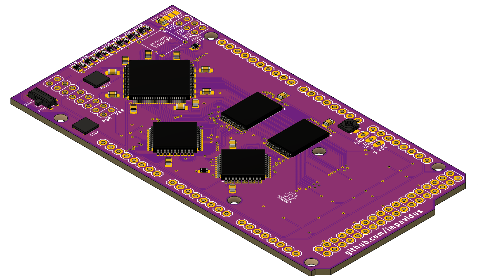
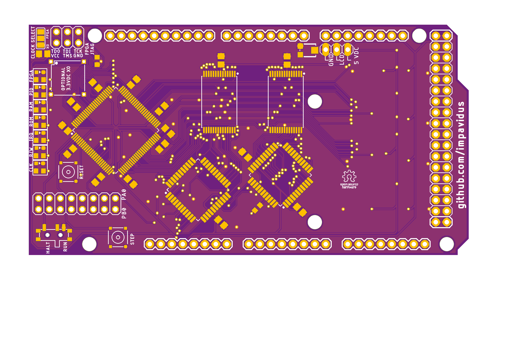
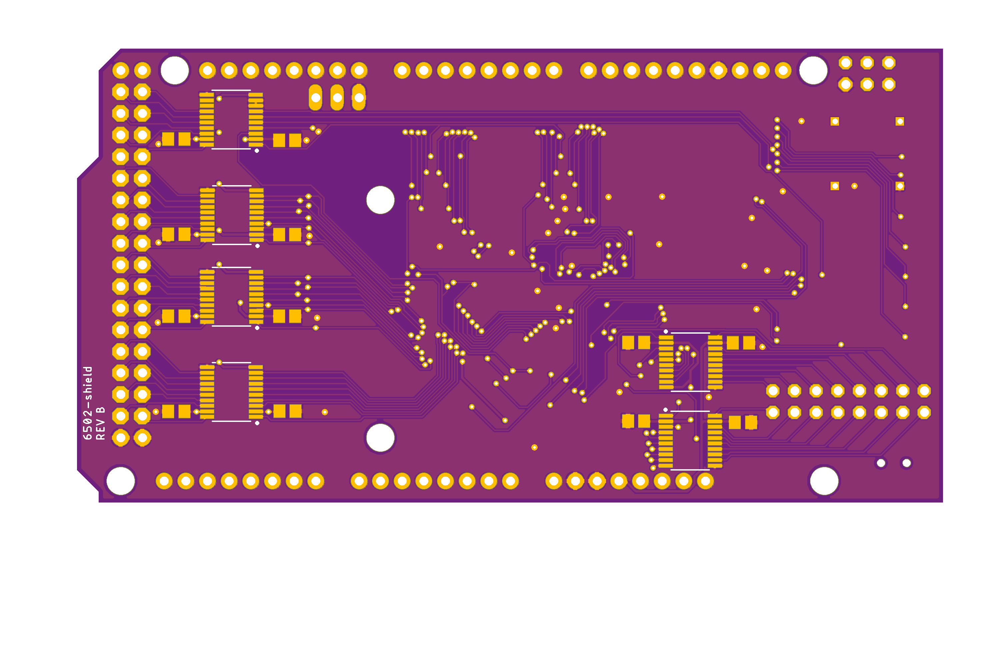
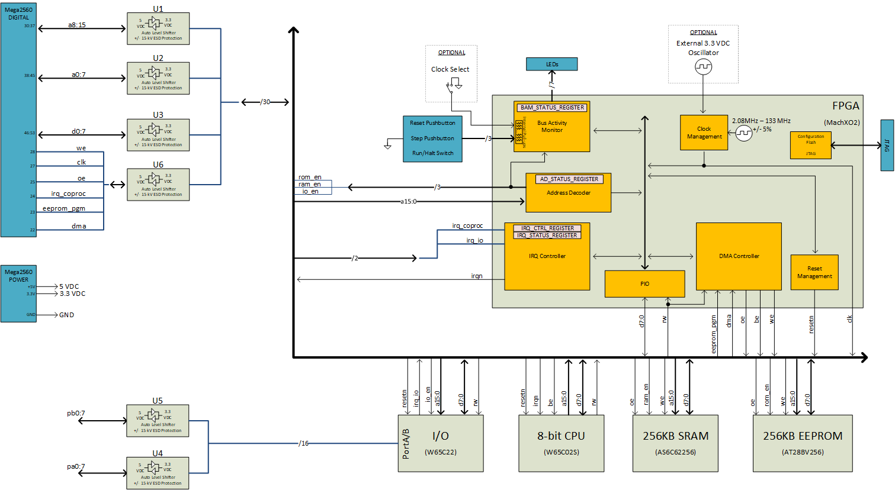

# 6502-shield

An Arduino shield that provides a 6502 cpu, ram, rom, and pio compactly.

## Project Status

I'm about to order the first prototype PCBs from OSH Park.  That means this PCB is completely untested and quite likely may burst into flames when powered on.  However, I am by no means here to tell you how to live your life so if you want to make one... =)

## Introduction

The 6502 shield provides (err will provide) most of the major components needed to implement a 6502 based computer.  Some of the key features.  This is aspirational and subject to change.

* Fully static design allows for single step execution of programs
* W65C02S - 8 bit CPU, W65C22 PIO controller, AT28BV256 256K EEPROM, AS6C62256 256K SRAM
* Full access to PIO PORTA and PORTB via header
* LCD header with potentiometer provides power, ground, and contrast adjust
* All components are leaded and reachable with mini-grabbers
* Support for optional DIP-8/4 3.3V External Crystal Oscillator
* Clock select jumper allows board to run from Internal FPGA clock or External XO
* LED status indicators for R/W, IRQ, CLK pins
* LED status indicators show when a devices address space is being accessed by the CPU (RAM/ROM/PIO/FPGA)
* FPGA manages chip enables based on user defined memory map.
* EEPROM write protection for EEPROM address space.
* EEPROM is programmed directly by Arduino asserting EEPROM_PGM line. This also disables EEPROM write protection in place during normal operation.
* DMA access from the Arduino to the 256K SRAM supported by asserting DMA line.
* FPGA clock supports run/halt/step via on-board push-button and slide switches.

## PCB

## Schematic

A PDF version of the schematic is <a href="docs/6502-shield-schematic.pdf">here</a>.

## System Block Diagram

## Source Files

All of the schematic capture and board layout work was done with Eagle.  The component libraries used, .sch, and .brd files are provided.

## CAM Files

All CAM files needed for PCB manufacturing including silkscreens, drills, etc. are provided.  In addition pick and place files and a Bill of Materials is provided in the CAMOutputs/Assembly folder.

## Models

The 3d model was done with AutoDesk Fusion.  The source file as well as .STEP file for the completed shield is provided.

## FPGA

The FPGA work is all going to be done in VHDL.  Once I begin writing it, I will add all of the source files, testbenches, etc. to the repository.

## 6502 Code

Also plan to provide some simple example assembly that demonstrates all the boards functions are working.  This will also be added to the repository.

## Acknowledgements

* Ben Eater - His breadboard computer projects are making homebrew cool again.  Ben's work heavily influenced my decision to attempt this project as well as inspiring me to make it all open and available for anyone.  If you're just getting started, please start with Ben's site, even if you don't build the breadboards yourself (but you should if at all possible) - seriously -  Thanks Ben.  < http://eater.net >

* Daryl Rictor - Thank you Daryl for sharing your Memory Decoder GAL based design to achieve a flexible memory map.  I am applying your approach in the FPGA of my design. < http://sbc.rictor.org/decoder.html >

* r/beneater - Pretty cool community even though I'm a lurker.  Seeing everybody else's builds made me give it a try, thanks for that everyone.  https://reddit.com/r/beneater

